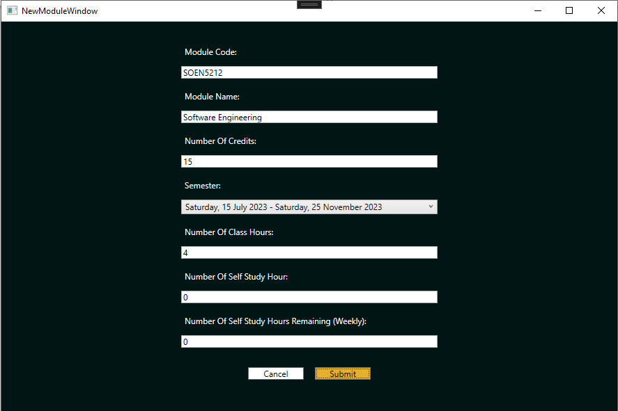
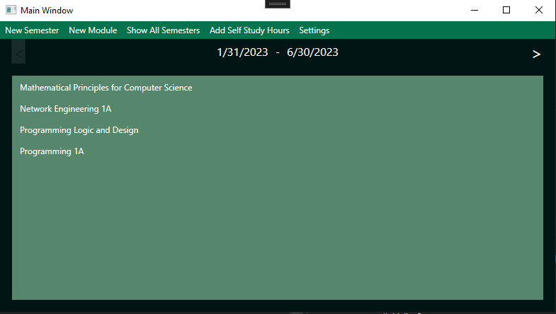

# Plannabelle (Desktop)

The desktop platform of Plannabelle made with WPF/C# and Azure SQL

# Some features
# Add save your modules to a database

# View all your modules in a central dashboard

# Requirements
In order to contribute or run plannabelle you will need the following:
- Visual Studio 2019 or higher
- .NET Core 3.1
- Have the WPF SDK installed using Visual Studio Installer

# How build and run
1) Clone [this](https://github.com/MfundoZA/Plannabelle) repo on to your local machine.
2) Open the Plannabelle folder on Visual Studio
3) Select the "Plannabelle-WPF" solution and click "Run Plannabelle-WPF"

# Change log
* Implemented databinding to allow UI updates to occur when data values change
* Made the UI more appealing through the use of styling
* Published database to Azure and updated connection string
* Moved a few properties from Module to bridge entity class to resolve database errors
